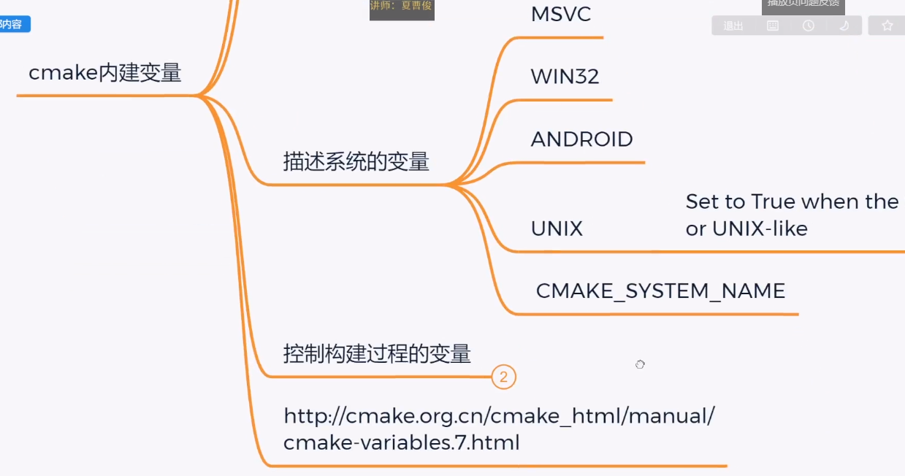
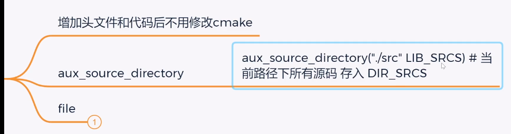
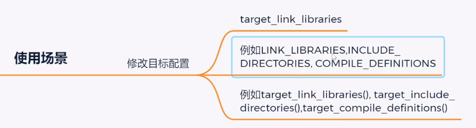
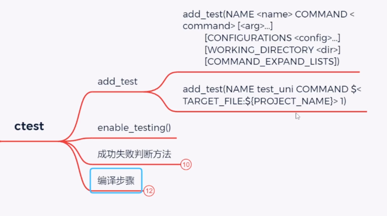
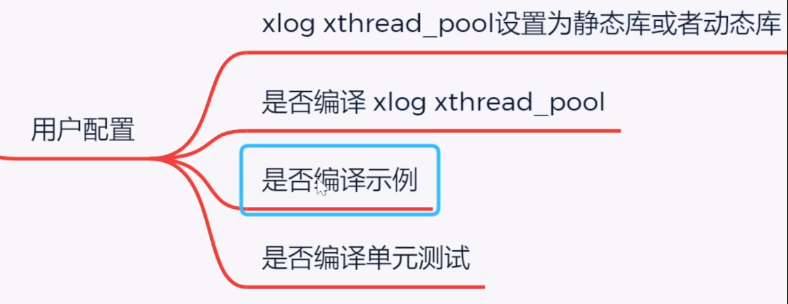

# CMake快速入门

##  01 cmake课程介绍 17:09

##  02 第一章介绍 04:27

##  03 cmake是什么为什么要好的构建工具06:52

##  04 什么是持续集成05:52

##  05 为什么用cmake及它的特性05:50

##  06 cmake工作原理图解分析04:35

##  07 cmake源码linux_ubuntu_编译安装10:50

##  08 cmake windows安装二进制版本06:29

##  09 windows下使用cmake编译cmake源码并安装12:18

##  10 macos_cmake安装源码编译09:26

##  11 fist_cmake第一个CMakeLists.txt示例10:07

##  12 windows下用vs2022编译第一个cmakelists.txt08:22

##  13 windwos下用cmake生成nmake的项目并编译06:50

nmake


##  14 linux和macos下编译第一个cmake c++项目10:13

```cmake
#cmake多线程编译
cmake --build build/ -j32

# 使用相关的应用程序打开已生成的项目。只有某些生成器支持这个操作
cmake --open build
```


##  15 编译cmake库的前置准备和静态库的实战原理分析09:48

> **静态库和动态库的区别**
>
> - **版权的问题**
>
> 绝大多数开源的库都是不开放静态库的，只能是共享库
>
> - **依赖库的问题**
>
> ​	在Windows中，线程库有两个版本静态的和动态的，比如你的库引用的线程库是静态的，而调用的库的程序用的是动态的，就会报编译的错误，两个库要一致的错误
>
> - **编译的时间的问题**
>
> ​	动态库的编译时间是静态库的10分之一
>
> - **命名的问题**
>
> windows 
>
> ​	编译静态库，release版和debug版的名字不同
>
> ​	release：xlog.lib
>
> ​	debug  ：xlog_d.lib
>
> unix
>
> ​	编译静态库，release版和debug版的名字相同
>
> **总结**
>
> 静态库的好处是运行简单，编译麻烦
>
> 动态库的好处是编译简单，运行麻烦


##  16 动态库原理和头文件作用09:17

##  17cmake静态库xlog跨平台编译windows、linux、macos11:23

**Windows**

xlog.lib

xlog.pdb 调试用的

##  18 cmake 链接静态库19:43

```
└── 102cmake_lib
    ├── test_xlog
    │   ├── CMakeLists.txt
    │   └── test_xlog.cpp
    └── xlog
        ├── CMakeLists.txt
        ├── xlog.cpp
        └── xlog.h
```

**xlog源码**

```
#CMakeLists.txt
cmake_minimum_required(VERSION 3.20)
project(xlog)
add_library(xlog STATIC xlog.cpp xlog.h)

//xlog.h
#ifndef XLOG_H
#define XLOG_H
class XCPP_API XLog
{
public:
    XLog();
};
#endif

//xlog.cpp
#include "xlog.h"
#include <iostream>
using namespace std;
XLog::XLog()
{
    cout<<"Create XLog"<<endl;
}
```

**test_xlog源码**

```
#CMakeLists.txt test_xlog 102
cmake_minimum_required(VERSION 3.20)
project(test_xlog)
#指定头文件查找路径 
include_directories("../xlog")

# 指定库查找路径  window自动找 ../xlog/build/Debug  ../xlog/build/Release
link_directories("../xlog/build")

add_executable(test_xlog test_xlog.cpp)

# 指定加载的库
target_link_libraries(test_xlog xlog)

// test_xlog.cpp
#include <iostream>
#include "xlog.h"
using namespace std;
int main()
{
    XLog log;
    cout<<"test xlog"<<endl;
    return 0;
}
```


##  19 cmake 动态库编译和链接linux14:08

```
└── 102cmake_lib
    ├── CMakeLists.txt
    ├── test_xlog
    │   ├── CMakeLists.txt
    │   └── test_xlog.cpp
    └── xlog
        ├── CMakeLists.txt
        ├── xlog.cpp
        └── xlog.h
```


```cmake
cmake_minimum_required(VERSION 3.20)
project(blp_ch01_part20_dylibTest_Windows_mac)
include_directories(xlog)
add_library(blp_ch01_part20_xlog SHARED xlog/xlog.cpp)
add_executable(blp_ch01_part20_test_xlog test_xlog/test_xlog.cpp)
target_link_libraries(blp_ch01_part20_test_xlog blp_ch01_part20_xlog)
```


**xlog源码**

```
//xlog.h
#ifndef XLOG_H
#define XLOG_H
class XCPP_API XLog
{
public:
    XLog();
};
#endif

//xlog.cpp
#include "xlog.h"
#include <iostream>
using namespace std;
XLog::XLog()
{
    cout<<"Create XLog"<<endl;
}
```

**test_xlog源码**

```
// test_xlog.cpp
#include <iostream>
#include "xlog.h"
using namespace std;
int main()
{
    XLog log;
    cout<<"test xlog"<<endl;
    return 0;
}
```


##  20 cmake动态库windows和mac测试14:39

# 第二章：CMake常用功能

##  01 第二章介绍 04:47                                                         

##  02 cmake注释和message基础11:27                                              

##  03 cmake message高级使用-指定日志级别07:30   

      


##  04 cmake message日志级别代码演示和重定到文件16:43                           

##  05 cmake message 模块查找日志和显示缩进12:01                                

##  06 cmake set变量入门和示例10:58       


    

  


##  07 cmake 变量示例设置message消息颜色11:22                                   


##  08 cmake自带的四种变量和给c++传递变量演示20:59                              





##  09 cmake include分析和示例12:05                                             


##  10 cmake自动载入项目源码文件20:44                                           





##  11 CMake file自动导入头文件到项目04:43                                      

##  12 CMake分步编译和清理指定target目标18:12                                   


##  13 cmake调试打印生成的具体指令10:51      


##  14 CMake设置输出路径跨平台演示分析23:06                                     


##  15 cmake add_subdirectory05:23    


# 第三章：CMake主要语法

##  01 第三章介绍 03:41


##  02 cmake if语法说明与常量判断代码演示18:27    


### if(\<constant>)


### if(\<variable>)


### if(\<string>)


##  03 cmake if 变量和字符串判断代码演示07:39     


##  04 cmake if逻辑运算符06:55                    


##  05 cmake if一元、二元比较和正则匹配16:46      


##  06 cmake cache缓存变量设置14:16               


##  07 cmake普通变量和全局CACHE变量作用域测试11:30

##  08 cmake-gui与CACHE缓存变量的各种类型09:45


##  09 cmake用户修改配置和option05:44         

option的变量是缓存变量


Linux也有ccmake，使用

```sh
cmake -S . -B build
ccmake ./build
```


##  10 CACHE覆盖策略设置cmake_policy09:17


##  11 cmake命令 传递缓存变量07:21


##  12 cmake 属性说明set_property08:44


##  13 cmake全局属性和APPEND_STRING get_property11:08

##  14 cmake define_property属性说明设置和获取10:49

##  15 cmake文件属性和给c++传递预处理变量示例14:22


##  16 cmake目标属性设置给c++传递多个宏12:02

##  17 cmake属性调试cmake_print_properties06:31


##  18 cmake env环境变量实战14:24


##  19 cmake math数学计算06:02


##  20 cmake string查找和字串相关处理20:52


##  21 cmake string追加替换和正则匹配06:35

##  22 cmake string json增删改23:00

##  23 cmake list追加、读取和拼接12:56

##  24 cmake list子数组和查找删除插入修改12:36

##  25 cmake list双向队列操作和排序09:28

##  26 cmake foreach遍历RANGE11:34


##  27 cmake foreach遍历list和break()16:47

##  28 cmake while循环06:04

##  29 cmake macro宏原理接口分析08:06


##  30 cmake macro参数传递12:01

宏参不是变量，只能取值使用


##  31 cmake_parse_arguments宏传递属性类参数14:30


##  32 cmake function函数演示09:53


##  33 cmake函数和变量的作用域演示11:05


# 第四章：cmake生成表达式和文件操作

##  第四章介绍 02:23

##  01 cmake 生成表达式讲解和应用场景分析13:00





##  02 cmake条件表达式和逻辑表达式示例11:22      


##  03 cmake生成表达式的两种调试方法（重要）11:57

##  04 cmake字符串比较表达式和条件表达式10:10    


##  05 cmakes生成表达式目标相关查询09:22    


# 第五章：CMake跨平台c++编译特性设置

##  01 第五章介绍 03:21

##  02 target_include_directories包含目录详解09:25      


##  03 PUBLIC_INTERFACE依赖传递头文件引用路径17:15      


##  04 target_link_libraries和属性的原生调试方法14:14   

##  05 target_compile_definitions演示静态库宏的传递09:10


##  06 target_compile_features16:12                     


##  07 cmake编译和链接OBJECT文件17:29                   


##  08 cmake动态库的生成版本号符号链接10:48             


##  09 cmake_debug_release配置说明10:56                 


##  10 cmake linux下配置Debug和Release13:18


##  11 cmake windows下配置Debug和Release08:00

##  12 cmake动态库跨平台Debug和Release不同输出路径23:59

##  13 cmake_vs_pdb文件输出配置07:50


##  14 vs的debug和release设置不同的调试工作路径07:02


##  15 CMake VS设置运行时库MD_MTD16:49


##  16 vs的souce_group代码分组显示10:35


# 第六章：CMake install部署项目

##  01 第六章介绍 02:52  

                                                       

##  02 cmake install功能说明和测试项目代码准备16:51                             


##  03 cmake 第一个install示例多平台演示部署10:40                               

##  04 cmake install动态静态库和头文件安装路径设置12:37                         


##  05 cmake install Debug和Release版本不同安装路径13:52                        


##  06 cmake install 文件按类型发布和权限设置18:21                              


##  07 cmake install目录过滤git和指定后缀文件14:06


##  08 cmake install code安装期间执行代码06:22


##  09 cmake install分组安装06:01


##  10 cmake find_package 分析10:28


##  11 cmake install export自定义package16:55

##  12 find_package自定义package07:36

##  13 多版本自定义package共存25:29


# 第七章：CMake 交叉编译

##  01 第七章介绍 04:08                           


##  02 cmake 交叉编译分析和测试代码准备16:11      


##  03 cmake交叉编译linux arm开发板程序09:37      


##  04 cmake交叉使用NDK交叉编译安卓静态库19:33    


##  05 导入cmake编译的库到安卓项目并支持多ABI11:53


##  06 创建并分析鸿蒙ets的c++native项目10:56      


##  07 cmake编译鸿蒙Hap应用的c++库16:27   


# 第八章：cmake单元测试

##  01 第八章介绍 03:48


##  02 cmake_ctest单元测试分析和测试示例18:16     




##  03 使用CMake的Fetch自动下载编译googletest09:59

##  04 建立第一个cmake调用googletest的示例09:36   

##  05 cmake解压编译安装gtest并测试22:20


##  06 googletest完整单元测试TEST_F08:37


##  07 解决googletest在vs上运行时库不一致问题07:12


# 第九章：CMake实战开源项目xcpp

##  01 第九章介绍 02:18


##  02 CMake实战开源项目cmake配置需求分析17:10





##  03 xlog库项目配置项目源码头文件和静态库宏传递23:08   


##  04 配置xlog输出路径设置Debug Release输出路径一致16:44


##  05 xlog的install配置并支持find_package19:26


##  06 xlog生成c++代码并支持用户配置动态库16:37                                 

##  07 重构xlog的cmake完成cpp_libaray函数并导入线程池库30:52                    

##  08 配置test_xlog项目完成linux上测试24:42                                    

##  09 配置test_xlog可配置在vs上读取xlog静态库22:40                             

##  10 xthread_pool库和样例加入项目配置04:30

##  11 cmake同时编译四个项目并添加依赖关系13:32

##  12 完成xlog和xthread_pool单元测试30:52


# 第十章：cmake补充章节

##  01 cmake构建vs_qt项目示例程序完成 08:40


##  02 cmake设置QT的SDK路径加载qt库和头文件 12:34

##  03 qt程序执行的依赖库自动复制 02:48

##  04 cmake导入qt库完成qt界面示例代码-有资源找不到错误 12:09

##  05 生成qt资源、界面和信号槽c++代码 14:24                 

##  06 cmake编译QT项目输出x86和x64程序 12:29                 

##  07 cmake_qt项目install07:07                              

##  08 cmake自动复制qt依赖库并完成install22:35    