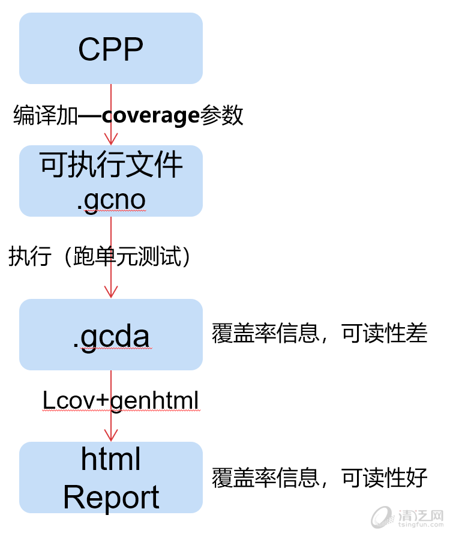
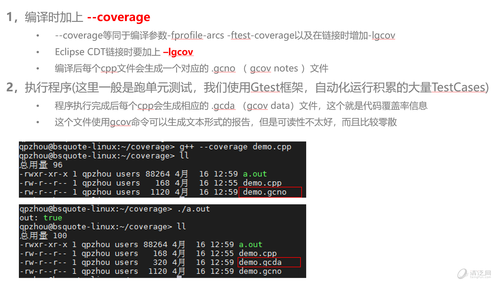
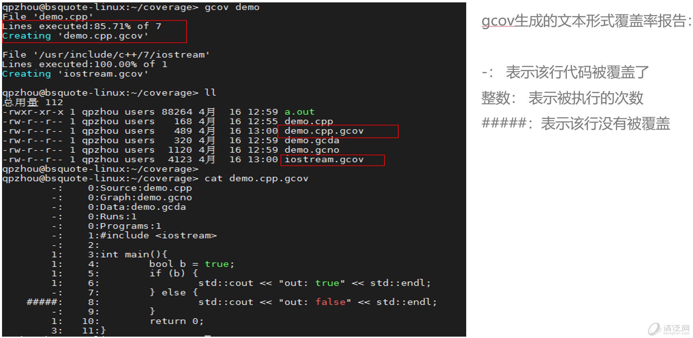
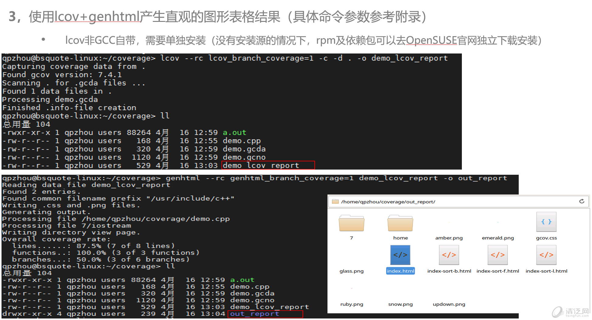
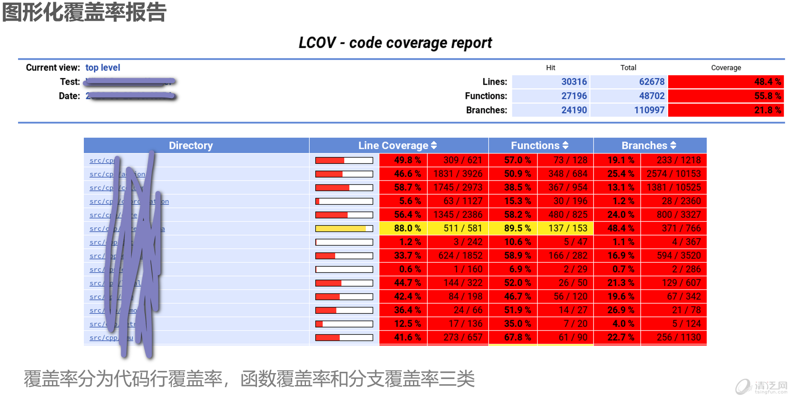
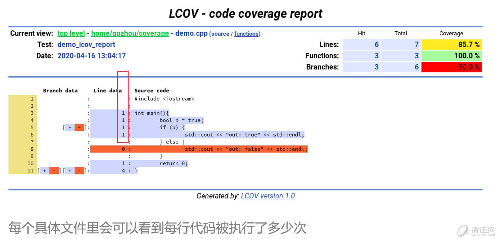
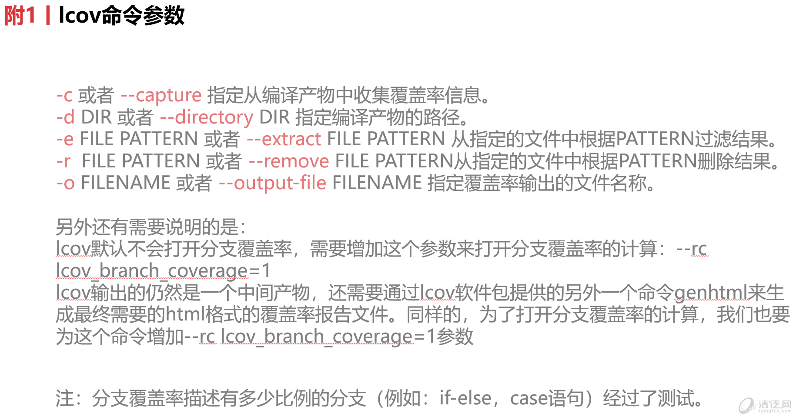

本文主要介绍Linux下C++单元测试下的代码覆盖率统计的方法，测试框架采用[gtest](javascript:;)，当然也可以使用其他的，这里不做过多的说明，主要介绍代码的覆盖率统计方法。

```cpp
#include<stdio.h>
#include<stdlib.h>
#include<string.h>

int *twoSum(int *nums, int numsSize, int target)
{
    int loop = 0;
    int inloop = 0;
    int *result = NULL;
    result = (int *) malloc(2 * sizeof(int));
    memset(result, 0, 2 * sizeof(int));
    printf("numsSize=%d\n", numsSize);
    if(NULL == nums || numsSize == 0)
    {
        return result;
    }
    for(loop = 0; loop < numsSize; loop++)
    {
        for(inloop = loop + 1; inloop < numsSize; inloop++)
        {
            if(*(nums + loop) + * (nums + inloop) == target)
            {
                if(NULL != result)
                {
                    *result = loop;
                    *(result + 1) = inloop;
                }
                return result;
            }
        }
    }
    return result;
}

int main(int arg, char* argv[])
{
    int nums[4] = {2, 7, 11, 15};
    int target = 9;
    int numsSize = 4;
    int *result = twoSum(nums, numsSize, target);
    printf("index1:%d\nindex2:%d\n", *result, *(result + 1));
}
```


## **一、什么是gcov**

gcov是gcc自带的的代码覆盖率测试工具，结合lcov可以产生图形化多维度的覆盖率报告。


## **二、基本使用流程**

## 






## **三、附录**



**可以过滤/剔除目录：**

```sh
lcov --rc lcov_branch_coverage=1 -e xxx.tmp  '*src/*' -o xxx
lcov --rc lcov_branch_coverage=1 -r xxx.tmp '/usr/include/*' '*lib/*' -o xxx
```


**Demo shell**:

```shell
g++ --coverage demo.cpp # demo.gcno
./a.out   # demo.gcda
gcov demo # demo.cpp.gcov
cat demo.cpp.gcov

lcov --rc lcov_branch_coverage=1 -c -d . -o demo_lcov_report
#all
#genhtml --rc genhtml_branch_coverage=1 demo_lcov_report -o out_report
#filter
lcov --rc lcov_branch_coverage=1 -r demo_lcov_report '/usr/include/*' '*lib/*' -o filtered_coverage
genhtml --rc genhtml_branch_coverage=1 filtered_coverage -o filtered_out_report
```

(完)

```sh
   69  g++ --coverage main.cpp
   70  ./a.out
   71  ./cmake-build-debug-wsl-kali/test/lcov-1.16/bin/lcov --rc lcov_branch_coverage=1 -c -d . -o main_report
   72  ./cmake-build-debug-wsl-kali/test/lcov-1.16/bin/genhtml --rc genhtml_branch_coverage=1 main_report -o report

```

